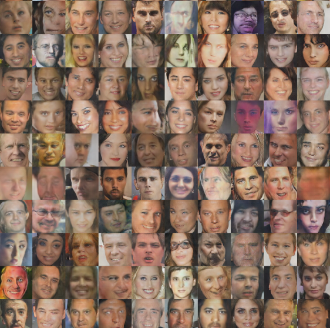

## GAN Implementations

                                        

Welcome to the Paper2Code repository! This repository contains implementations of Generative Adversarial Networks (GANs) as described in three influential papers. The implementations are provided from scratch, focusing on different aspects of GAN architectures and training techniques.

                                    

## Repository Structure

### 1. **`utils/`**
   - **`data_utils.py`**: Contains functions for data preprocessing and loading pipelines. This script is responsible for preparing datasets for training.
   - **`model_utils.py`**: Provides utilities for setting up batch normalization and gradient penalty techniques for various GAN implementations.
   - **`train_utils.py`**: Includes functions for saving and displaying images during the training loop, helping visualize the GAN’s progress.

### 2. **`GAN/`**
   - **`Generator.py`**: Defines the generator model for the GAN.
   - **`Discriminator.py`**: Defines the discriminator model for the GAN.
   - **`Model.py`**: Combines the generator and discriminator into a full GAN model and includes methods for training and evaluation.

### 3. **`train/`**
   - **`train.py`**: Contains the training loop for the GAN models. This script manages the training process, including optimization and loss calculations.
   - **`distribution.py`**: Includes utilities for distributed training across TPU and GPU backends, enabling efficient training on multiple devices.

### Other Files
- **`requirements.txt`**: Lists the dependencies required to run the code.
- **`README.md`**: This file, providing an overview of the repository and instructions for usage.
- **`papers/`**: Directory containing the research papers implemented in this repository.
- **`images/`**: Directory for storing images generated during training and testing.

## Papers Implemented

This repository includes implementations based on the following papers:

1. **[Unsupervised Representation Learning with Deep Convolutional Generative Adversarial Networks](https://arxiv.org/abs/1511.06434)**  
   Alec Radford, Luke Metz, Soumith Chintala  
   Introduces Deep Convolutional GANs (DCGANs) with a focus on convolutional networks for GANs.

2. **[On Convergence and Stability of GANs](https://arxiv.org/abs/1611.03824)**  
   Naveen Kodali, Jacob Abernethy, James Hays, Zsolt Kira  
   Discusses issues related to convergence and stability in GAN training and proposes solutions.

3. **[Improved Training of Wasserstein GANs](https://arxiv.org/abs/1704.00028)**  
   Ishaan Gulrajani, Faruk Ahmed, Martin Arjovsky, Vincent Dumoulin, Aaron Courville  
   Presents improvements to the Wasserstein GAN framework, including techniques for stabilizing training with gradient penalties.

## Getting Started

1. **Clone the Repository**
   ```bash
   git clone https://github.com/silvaxxx1/PAPER2CODE.git
   ```

2. **Install Dependencies**
   ```bash
   pip install -r requirements.txt
   ```

3. **Prepare the Data**
   Configure the `data_utils.py` script to load and preprocess your dataset.

4. **Train the Models**
   Run the training script:
   ```bash
   python train.py
   ```

5. **Distributed Training (Optional)**
   Use the `distribution.py` script to configure distributed training across TPU or GPU backends.

6. **Generate and View Images**
   The generated images during training will be saved in the `output` directory. You can view these images to monitor the GAN’s progress.

7. **View the Papers**

Certainly! Here’s how you can include an important note in the README to explain the default behavior and how to enable the additional techniques from the second and third papers:

---

## Important Note

This repository implements Generative Adversarial Networks (GANs) based on the first paper "Unsupervised Representation Learning with Deep Convolutional Generative Adversarial Networks" by Alec Radford et al. by default. 

### Default Configuration

- **Gradient Penalty**: By default, gradient penalty is not applied.
- **Optimization Techniques**: The optimization techniques introduced in the second and third papers are not enabled.

### Enabling Advanced Features

To enable the advanced optimization techniques and gradient penalty from the second and third papers, you need to make some modifications:

a. **Uncomment the Relevant Layers**: 
   - Locate the commented sections in the code where the gradient penalty layers and optimization techniques are implemented.
   - Uncomment these sections to activate them.

b. **Enable the Gradient Penalty Algorithm**:
   - Find the gradient penalty function and ensure it is used in the training loop.
   - Set the gradient penalty mode and weight as per your requirements.

For detailed implementation, check the respective code files and comments in the repository. 

## Directory Details

- **`utils/`**: Utility functions for data processing, model setup, and training.
- **`GAN/`**: Model definitions and full GAN implementation.
- **`train/`**: Scripts for training and distributed training.
- **`papers/`**: Research papers referenced.
- **`images/`**: Generated images from the training process.

## License

This repository is licensed under the [MIT License](LICENSE).

## Acknowledgments

- Implementations are based on the research papers cited above.
- Thanks to the authors of these papers for their contributions to the field of GANs.

