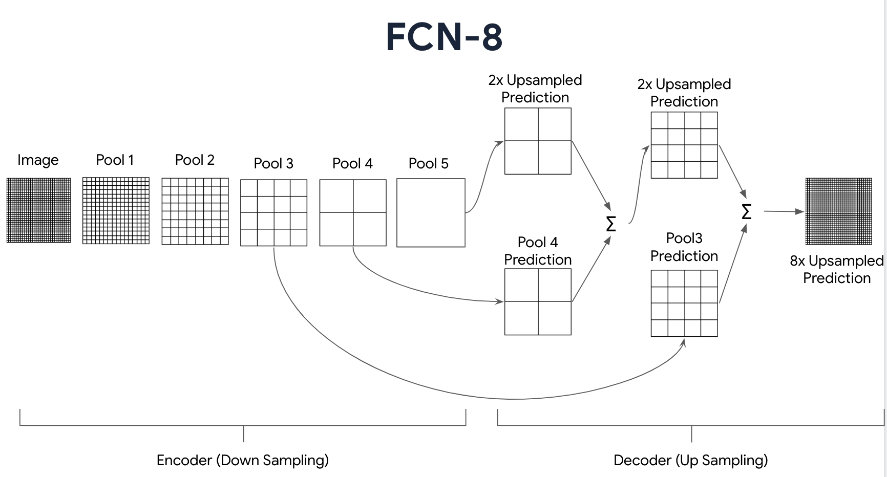

```markdown
# FC8_VGG

<div align="center">
  
  
</div>


## Description
This subproject implements the FC8 VGG model from scratch, based on the original research paper. The model is designed for image segmentation and classification tasks, utilizing the pre-trained VGG16 architecture with additional layers for fine-tuning.

## Dataset 
The dataset is provided by [divamgupta](https://github.com/divamgupta/image-segmentation-keras). This contains video frames from a moving vehicle and is a subsample of the [CamVid](http://mi.eng.cam.ac.uk/research/projects/VideoRec/CamVid/) dataset. You can download the custom dataset [here](https://drive.google.com/file/d/0B0d9ZiqAgFkiOHR1NTJhWVJMNEU/view?usp=sharing).

### Loading Pretrained Weights
To load pretrained VGG16 weights, use:

```bash
python MODEL/load_weights.py
```

### Training the Model
To train the model, run the following command:
```bash
python MODEL/train.py
```

### Running Inference
To run inference on test images, use:
```bash
python main.py
```

## Structure
- `MODEL/`: Contains the model architecture, training script, and pretrained weights.
- `UTILS/`: Utility scripts for metrics and visualization.
- `data/`: Scripts and data for training and testing.
- `images/`: Contains images of the output.
```

