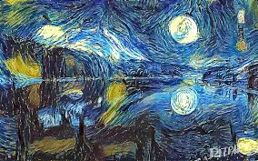
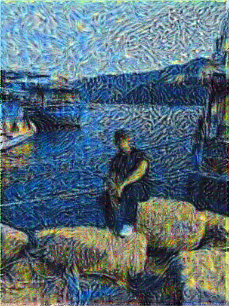

# Neural Style Transfer

This project implements neural style transfer using TensorFlow. It is based on the paper [*A Neural Algorithm of Artistic Style*](https://arxiv.org/abs/1508.06576) by Leon A. Gatys, Alexander S. Ecker, and Matthias Bethge. Below are the style, content, and resulting images.

## Images

### Style Image

### Content Image

### Resulting Image

## How to Run

To run the neural style transfer, follow these steps:
1. Clone this repository.
2. Install the required dependencies.
3. Run the `main.py` script with your content and style images.
